# Project 1 – The Fact-Checking Auditor (Finance)

## Overview
The Fact-Checking Auditor is an AI agent designed to automate the verification of factual claims in financial documents. Given a piece of text (e.g., a section of an annual report or bullet-point claims), the agent identifies key factual statements and checks them against reliable external sources. It outputs an **Audit Report** that labels each claim as True, False, or Not Sure, with evidence citations.

- **Domain:** Finance (financial reports, news, numeric data)
- **Key Techniques:** Retrieval-Augmented Generation (RAG), LLM prompt engineering, single-agent reasoning
- **ADK Focus:** `LlmAgent` with tool usage (no complex chaining)

By automating fact-checking, organizations like banks, investment firms, or regulators can reduce manual effort and errors.

## Features
- **Automated Claim Extraction** – Parses input text to isolate factual statements.
- **Web/Data Retrieval** – Performs searches to fetch evidence.
- **AI Verification** – Uses an LLM (e.g. Google Gemini) to classify each claim with reasoning.
- **Report Generation** – Produces Markdown/text reports with verdicts and references.
- **Iterative Check (optional)** – One retry with refined queries if initial results are unclear.

_No frontend included – console or Jupyter interaction only._

---

## Installation and Setup

### 1. Clone Repository
Ensure the following files are present:
- `fact_auditor.py` (main script)
- `search_tool.py` (search module)
- `README.md`, `SPEC.md`

### 2. Install Dependencies
```bash
pip install google-generativeai google-adk requests python-dotenv

```

### 3. Configure API Keys

Create a `.env` file in project root:

```bash
GOOGLE_API_KEY=<YOUR-PALM-API-KEY>
SEARCH_API_KEY=<YOUR-SEARCH-API-KEY>
SEARCH_API_URL=<endpoint-URL-if-needed>

```

### 4. Configuration Options

Edit `fact_auditor.py` if needed:

* `MAX_SEARCH_RESULTS`
* `CONFIDENCE_THRESHOLD`
* Input/output file paths

---

## Usage

### Option 1: From File

```bash
python fact_auditor.py --input sample_claims.txt

```

Generates `audit_report.md` by default.

### Example Output

```markdown
1. **Claim:** "Q4 2025 revenue increased by 15%."
   **Verdict:** ✅ Verified. *Official statement reports 16%.* 【Source: Q4 2025 Report】

2. **Claim:** "XYZ acquired ABC in 2022 for $5B."
   **Verdict:** ❌ False. *No evidence of acquisition in 2022.* 【Source: SEC Filings】

3. **Claim:** "2023 inflation rate was 4%."
   **Verdict:** 🔶 Not Sure. *Conflicting reports: 3.8%–4.1%.* 【Source: IMF Data】

```

### Option 2: Interactive Mode

```python
from fact_auditor import FactCheckingAgent
agent = FactCheckingAgent()
text = "Acme revenue up 20% in Q3. CEO is Jane Doe."
report = agent.verify_text(text)
print(report)

```

---

## Project Structure

```
project1-fact-checker/
├── fact_auditor.py
├── search_tool.py
├── report_formatter.py (optional)
├── sample_claims.txt
├── SPEC.md
└── README.md

```

---

## How it Works

The system operates on a linear `Extract → Verify → Output` pipeline, leveraging Google ADK principles for tool management.

```mermaid
graph TD
    %% Inputs
    InputDoc[📄 Input Document/Text] --> Extract[🔍 Extract Factual Claims]

    %% The Core Logic
    subgraph "Fact-Checking Agent"
        Extract -->|List of Claims| LoopStart{For Each Claim}
        
        LoopStart -->|1. Generate Query| Query[❓ Formulate Search Query]
        Query -->|2. Search External Data| SearchTool[🌐 Search Tool / API]
        
        SearchTool -->|3. Return Evidence| Compare[🧠 LLM Analysis]
        Compare -->|Compare Claim vs. Evidence| Verdict{Verdict?}
        
        Verdict -- "Matches" --> V_True[✅ Verified]
        Verdict -- "Conflicts" --> V_False[❌ False]
        Verdict -- "Insufficient Data" --> V_Unsure[🔶 Not Sure]
        
        V_True & V_False & V_Unsure --> Accumulate[📝 Log Result]
        Accumulate --> LoopStart
    end

    %% Output
    LoopStart -- "All Claims Processed" --> Report[📊 Generate Final Audit Report]

    %% Styling
    classDef input fill:#e1f5fe,stroke:#01579b,stroke-width:2px;
    classDef process fill:#fff9c4,stroke:#fbc02d,stroke-width:2px;
    classDef tool fill:#f3e5f5,stroke:#7b1fa2,stroke-width:2px;
    classDef output fill:#e8f5e9,stroke:#2e7d32,stroke-width:2px;

    class InputDoc input;
    class Extract,Query,Compare,Verdict,Accumulate,LoopStart process;
    class SearchTool tool;
    class Report,V_True,V_False,V_Unsure output;

```



1. **Splits input** into atomic factual claims.
2. **Searches evidence** using `SearchTool` (Web or internal DB).
3. **LLM evaluates** the claim against the retrieved evidence.
4. **Generates report** with verdicts and references.

---

## Example Scenario

**Use Case:** Auditing a press release.

* Claim: "Acme won the XYZ Award in 2025." → ❌ False (found other winner).
* Claim: "Revenue grew 50% in 2024." → ✅ Verified (via financial report).

---

## Limitations & Improvements

* **Knowledge Cutoff:** May miss very recent/proprietary data.
* **Reasoning Limits:** Doesn’t support multi-claim logic yet.
* **Language Support:** English only (for now)

